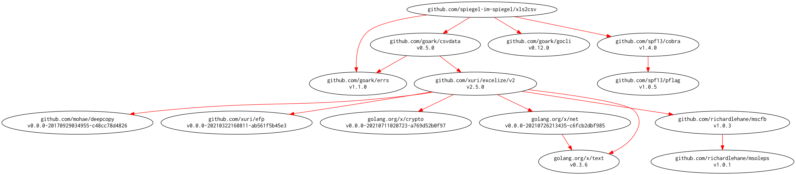

# [xls2csv] -- Export CSV Text from Excel Data

[](https://github.com/spiegel-im-spiegel/xls2csv/actions)
[](https://github.com/spiegel-im-spiegel/xls2csv/actions)
[](https://raw.githubusercontent.com/spiegel-im-spiegel/xls2csv/master/LICENSE)
[](https://github.com/spiegel-im-spiegel/xls2csv/releases/latest)

This package is required Go 1.16 or later.

## Download and Build

```
$ go install github.com/spiegel-im-spiegel/xls2csv@latest
```

## Binaries

See [latest release](https://github.com/spiegel-im-spiegel/xls2csv/releases/latest).

## Usage

```
$ xls2csv -h
Export CSV text from Excel data.

Usage:
  xls2csv [flags] <Excel file>

Flags:
      --debug             for debug
  -h, --help              help for xls2csv
  -o, --output string     path of output CSV file
  -p, --password string   password in Excel file
  -s, --sheet string      sheet name in Excel file
  -t, --tsv               output with TSV format
  -v, --version           output version of xls2csv
  -w, --win-newline       output with CRLF newline

$ xls2csv conv/testdata/test-pw.xlsx -p passwd
名前,年齢
Alice,18
Bob,19
太郎,20
花子,21
```

## Modules Requirement Graph

[](./dependency.png)

[xls2csv]: https://github.com/spiegel-im-spiegel/xls2csv "spiegel-im-spiegel/xls2csv: Export CSV Text from Excel Data"
